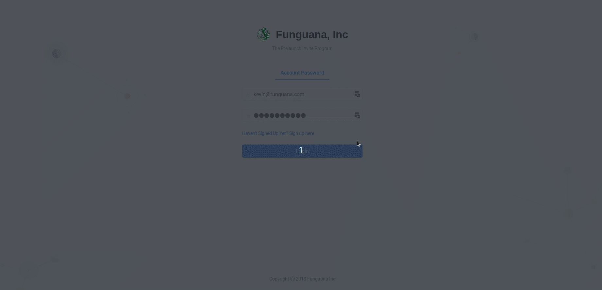

# Referral Frontend
The front-end application for your company's referral application. Make your modfications using react and port it to this async webserver.



## How to Install
---

To install, we use docker. Docker is the fastest installation. Run the following commands:

```bash
docker build -t referral_frontend .
```

That will give you the capacity to run a server using docker container. Then you run.

```bash
docker run -it -p 80:80 referral_frontend
```

This will let you test the UI server.
